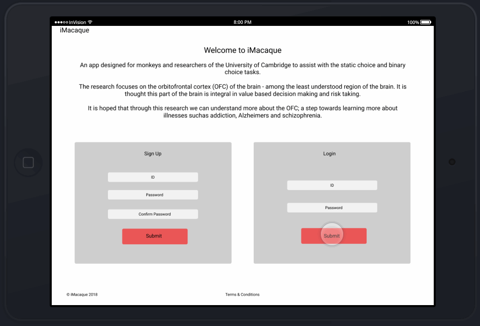
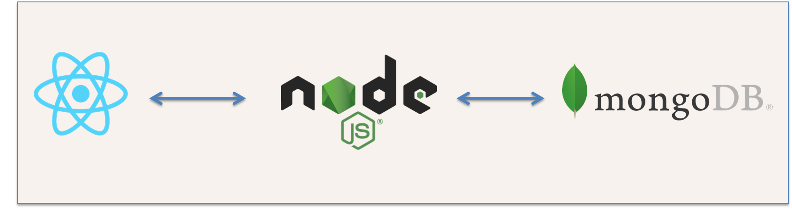

# iMacaque :monkey:

The iMacaque app is avaliable [here](https://imacaque.herokuapp.com/)

---

### Task

* Build a server rendered full stack app for use in research
* Use a non-relational database to store and retrieve data.

### User stories

As a researcher I want to...

* Accurately complete a **Static Choice Test** multiple times a day
* Record data (timing of every event) for each user
* Collect the timing of every event

### Data

Data will be collected as times and will be collected at 5 points in a single trial:

* Blankscreen (time = 0secs)
* Choices appear
* Choice is made (image/video displays)
* Video/image stops displaying (second blank screen)
* End of trial

Other data that is not time based that needs to be collected:

* Position of the stimulus on the page
* Choice made per trial
* Session Id
* Number of trials completed per session
* Monkey Id
* Date / Time

### Stretch Goals

* Change the images/videos provided to the monkey
* Adjust the timing of the choices being presented to the monkey
* Heat mapping
* Image recognition for authentication

---

## The App

### Design

A prototype of the app:

---

### Tech Stack

* MongoDB /mLabs / Mongoose
* React
* Node / Express
* Heroku

---

### How to run locally

You will need:

* mLabs account

Steps:

* Clone the repo `gitgit clone https://github.com/fac-12/iMacaque`
* Install dependencies `npm install`
* Create a `config.env` in your root directory. This will need:
* `DATABASE_URL =` [Your mLabs prod DB]
* Run the app in dev mode: `npm run dev`
